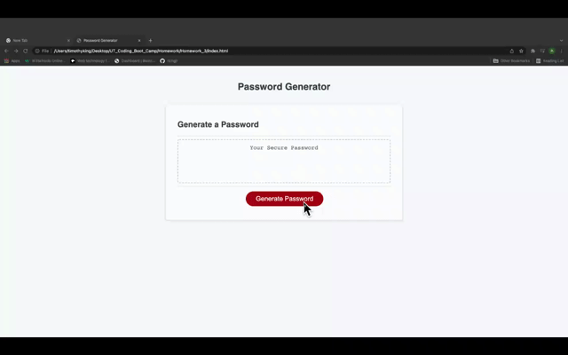

# Homework 3: Random Password Generator

**Version 1.0**

## Description

For this project, a password is randomly generated based on parameters that the user chooses when prompted.

When "Generate Password" is clicked, the user is prompted with the password length. If outside the range of 8-120, the user is prompted to enter a password length again within that range.

The application then prompts the user to choose whether or not to include uppercase letters, lowercase letters, numbers, and/or special characters

When all parameters have been defined, the password will appear within the password box.

## Screenshot

## Deployed Application

https://rkingjr.github.io/Homework_3/

## License and copyright

© Timothy King Jr.
